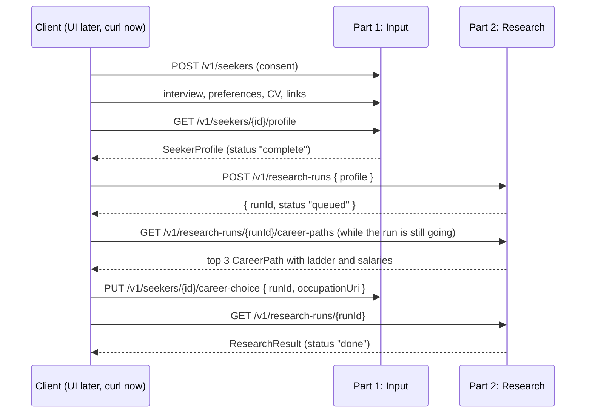

# API contract

The single source of truth for how the parts talk to each other. If an endpoint or a type changes, change it here first, in a PR both owners approve.

| Part (whiteboard) | Owner | Status |
|---|---|---|
| 1. User input: interview, career preferences, dream companies, CV, portfolio, GitHub and socials | @Dymyt-ry | building now, API only, no UI |
| 2. Research: user research, company research, vacancy listing, job market, top career paths | @cufelix | building now |
| 3. Validation: company requirements, requirement vs evidence per skill, market demand per career path | not assigned | names reserved below |
| 4. Output: roadmap, curated resources | not assigned | names reserved below |

## How the parts connect



**The handoff is one object: `SeekerProfile`.** Part 2 receives the whole profile in the request body, not a reference to it. Each part can be built and tested alone: Part 2 runs from a saved profile JSON file, and Part 1 needs Part 2 running only for the GDPR export and delete (below).

**Occupation and skill lookup is a shared module, not an endpoint.** `src/shared/taxonomy/` wraps the public ESCO API with a local cache, and both parts import it. @cufelix owns it. Part 1 uses it to turn "nurse" or "backend developer" into ESCO IDs, so there is no runtime call from Part 1 to Part 2 for it. Until it lands, Part 1 uses the stub in `src/shared/taxonomy/stub.ts`, which has the same function signatures and a few hard-coded entries.

**Part 1 calls Part 2 at runtime in two places:**
- The GDPR cascade: deleting or exporting a seeker also deletes or exports their research (see Part 1's export and delete endpoints).
- The career choice: Part 1 checks the chosen occupation against that run's `GET /v1/research-runs/{runId}/career-paths` before storing it.

## Conventions

- **Base path** `/v1`. A breaking change goes to `/v2`.
- **Auth:** `Authorization: Bearer <API key>` on every call. Keys come from environment variables, never from the repo. User login arrives with the UI.
- **JSON everywhere**, except the CV upload (`multipart/form-data`).
- **Response envelope**, the same on every endpoint:

  ```json
  { "ok": true,  "data": { }, "error": null, "meta": { "requestId": "req_…" } }
  { "ok": false, "data": null, "error": { "code": "not_found", "message": "Seeker skr_123 does not exist" }, "meta": { "requestId": "req_…" } }
  ```

  Lists add `meta.page`, `meta.pageSize`, `meta.total`, and take `?page=` and `?pageSize=` (max 100).
- **Error codes:** `bad_request` (400), `unauthorized` (401), `consent_required` (403), `not_found` (404), `conflict` (409), `unprocessable` (422, input fails validation), `rate_limited` (429), `upstream_failed` (502, a scraper or API failed), `internal` (500).
- **IDs** are prefixed strings: `skr_` seeker, `doc_` document, `lnk_` link, `run_` research run, `cmp_` company, `vac_` vacancy, `clm_` claim, `src_` source.
- **Standards:**
  - Timestamps: ISO 8601 UTC, `2026-10-08T21:00:00Z`.
  - Countries: ISO 3166-1 alpha-2, `CZ`.
  - Languages: BCP 47, `cs`.
  - Currencies: ISO 4217, `EUR`.
  - Occupations and skills: ESCO URIs.
- **Validation:** every request body is checked against the types below. Unknown fields are rejected with `unprocessable`.
- **Who mints IDs:** each part mints IDs for the objects it creates, as `prefix_` + ULID, so they are globally unique. Part 1 creates the `stated` claims and their sources; Part 2 keeps those IDs unchanged and mints its own for everything it finds.
- **Sources without a web URL** use an internal URI:
  - a CV: `seeker-upload://doc_…`
  - an interview turn: `seeker-interview://skr_…#turn-7`

  `contentHash` is the SHA-256 of the uploaded file or of the turn's text.

## Part 1: User input (@Dymyt-ry)

| Method and path | Does | Body | Returns |
|---|---|---|---|
| `POST /v1/seekers` | Create a seeker. Consent is required here. | `{ consent: Consent }` | `{ seekerId }` |
| `POST /v1/seekers/{seekerId}/interview/messages` | One turn of the intake interview. The agent asks; the client sends the seeker's answer. Send an empty `text` to get the first question. | `{ text: string }` | `{ reply: string, done: boolean, preferences: CareerPreferencesDraft }` |
| `GET /v1/seekers/{seekerId}/interview` | Full interview transcript | | `InterviewTurn[]` |
| `PUT /v1/seekers/{seekerId}/preferences` | Set or correct preferences directly, without the interview. Must be complete. | `CareerPreferences` | `CareerPreferences` |
| `POST /v1/seekers/{seekerId}/documents` | Upload a CV (PDF, DOCX, ODT, TXT, Markdown, JPEG, PNG or WebP, max 10 MB). Parsed into stated skills. | multipart field `file` | `SeekerDocument` |
| `DELETE /v1/seekers/{seekerId}/documents/{documentId}` | Remove a CV and everything parsed from it | | `{ deleted: true }` |
| `PUT /v1/seekers/{seekerId}/links` | Replace the seeker's list of links (portfolio, GitHub, socials). Part 1 stores them; reading them is Part 2's user research. | `{ links: SeekerLinkInput[] }` | `SeekerLink[]` |
| `PUT /v1/seekers/{seekerId}/career-choice` | The seeker picks one of the run's career paths, usually while the rest of the research is still running. Part 1 accepts only an occupation that run returned (`unprocessable` otherwise), stores it as `profile.careerChoice` (profileVersion +1) and leaves `preferences` as they are. Calling it again replaces the choice. | `{ runId: string, occupationUri: EscoUri }` | `CareerChoice` |
| `GET /v1/seekers/{seekerId}/profile` | **The handoff object.** `status` is `"complete"` once preferences have at least one target occupation and consent is given. | | `SeekerProfile` |
| `GET /v1/seekers/{seekerId}/export` | Everything stored about the seeker in both parts (GDPR). Part 1 adds the runs from Part 2's `GET /v1/seekers/{seekerId}/research-runs`. | | `SeekerExport` |
| `DELETE /v1/seekers/{seekerId}` | Hard delete in both parts (GDPR). Part 1 calls Part 2's `DELETE /v1/seekers/{seekerId}/research` first. If that fails, it answers `upstream_failed`, marks the seeker `deletion-pending` and retries until both are gone. | | `{ deleted: true }` |

## Part 2: Research (@cufelix)

| Method and path | Does | Body | Returns |
|---|---|---|---|
| `POST /v1/research-runs` | Start research for a profile. Returns at once; work runs in the background. Rejects a profile whose `status` is not `"complete"`. | `{ profile: SeekerProfile, options?: ResearchOptions }` | `{ runId, status: "queued" }` |
| `GET /v1/research-runs/{runId}` | Status, progress, and the result once `status` is `"done"` | | `ResearchRun` |
| `GET /v1/research-runs/{runId}/career-paths` | Up to 3 career paths (the whiteboard's "top 3"). Candidates are the seeker's target occupations plus related ESCO occupations. Selection and order come only from market demand in the seeker's locations and the seeker's stated goal, never from skill fit or evidence. The `career-paths` step runs first, and this endpoint answers as soon as that step is done, while the run is still `running`, so the client can show the paths and let the seeker pick one during the rest of the research. Each path carries its career ladder (for example junior → mid → senior → lead → CTO) with a sourced salary per step where one is found. Fields filled later in the run (`vacancyCount`, ladder salaries) may change until the run is `done`. | | `CareerPath[]` (in order) |
| `GET /v1/research-runs/{runId}/companies` | Companies researched in this run, dream companies first | | `Company[]` (paged) |
| `GET /v1/research-runs/{runId}/vacancies` | Vacancies found in this run. Filters: `?occupation=` `?companyId=` | | `Vacancy[]` (paged) |
| `GET /v1/research-runs/{runId}/market` | Job market per career path: demand per skill, vacancy counts, salary ranges | | `JobMarket[]` |
| `GET /v1/research-runs/{runId}/trends` | Then vs now per target occupation: each skill's demand about ten years ago against the last 12 months and today's vacancies, labelled rising, stable or fading, with quotes. Keeps advice built on older career paths current. | | `OccupationTrends[]` |
| `GET /v1/research-runs/{runId}/seeker-research` | User research: what the seeker's links show, plus the opt-in name search | | `SeekerResearch` |
| `DELETE /v1/research-runs/{runId}` | Cancel a running run or delete a finished one | | `{ deleted: true }` |
| `GET /v1/seekers/{seekerId}/research-runs` | All runs stored for a seeker, with results (used by Part 1's export) | | `ResearchRun[]` |
| `DELETE /v1/seekers/{seekerId}/research` | Hard delete of every run, user-research result and name-search candidate for a seeker (used by Part 1's delete) | | `{ deleted: true, runs: number }` |
| `GET /v1/companies/{companyId}` | One company with all its claims and sources (shared across runs) | | `Company` |
| `GET /v1/vacancies/{vacancyId}` | One vacancy with every sighting (when and where it was seen) | | `Vacancy & { sightings: VacancySighting[] }` |

## Parts 3 and 4: reserved, not designed yet

These names are taken so the first two parts don't use them for something else.
- `POST /v1/validations { profile, runId }` → `Validation` (requirements, requirement vs evidence per skill, market demand per career path; no chance-of-getting-hired estimate).
- `POST /v1/roadmaps { validationId }` → `Roadmap`.

Guardrail for both: no single score, match percentage or ranking of a person. That comes from the brief.
The same holds for career paths: the ladder and its salaries describe the occupation in the seeker's locations, never the seeker's chance of reaching a step. The seeker's `careerChoice` is their pick, not ours.

## Types

Copy these into `src/contracts.ts` in both parts. The field names are the contract.

```ts
// ---------- shared ----------
type ISODate = string;            // "2026-10-08T21:00:00Z"
type Country = string;            // ISO 3166-1 alpha-2, "CZ"
type EscoUri = string;            // "http://data.europa.eu/esco/occupation/…"

type Source = {
  id: string;                     // "src_…"
  url: string;                    // web URL, or seeker-upload://… / seeker-interview://… (see Conventions)
  title: string;
  fetchedAt: ISODate;
  tool: "apify" | "firecrawl" | "exa" | "registry" | "seeker-upload" | "seeker-link" | "seeker-interview";
  quote?: string;                 // must appear verbatim in the stored snapshot
  contentHash: string;
  snapshotKey?: string;           // raw copy in object storage
};

type Claim = {
  id: string;                     // "clm_…"
  subject: { kind: "company" | "vacancy" | "seeker"; id: string };
  statement: string;              // "Requires Docker", "Has a public project using Docker"
  skill?: Skill;                  // set on every skill claim, so parts compare ESCO URIs, never prose
  kind: "fact" | "inference";
  tier: "verified" | "corroborated" | "single-source" | "contradicted" | "stated";
                                  // "stated" = said by the seeker only, never counts as proof
  sources: Source[];              // a claim without sources is never returned
  validUntil?: ISODate;
};

type Occupation = { uri: EscoUri; label: string; lang: string };
type Skill = { uri: EscoUri; label: string; lang: string };

// ---------- Part 1: user input ----------
type Consent = {
  dataProcessing: true;           // required
  nameSearch: boolean;            // opt-in for the light web search on the seeker's name
  givenAt: ISODate;
  policyVersion: string;
};

type CareerPreferences = {
  targetOccupations: Occupation[];          // at least 1 for a complete profile
  locations: { country: Country; city?: string }[];
  remote: "only" | "ok" | "no";
  goal: "learn-fast" | "stability" | "mission";
  dreamCompanies: { name: string; url?: string }[];
  dealBreakers: string[];                   // free text from the interview
  languages: { lang: string; level: "basic" | "working" | "fluent" | "native" }[];
  salaryExpectation?: { min: number; currency: string; period: "month" | "year" };
};

type CareerPreferencesDraft = Partial<CareerPreferences>;   // what the interview has filled in so far

type InterviewTurn = { role: "agent" | "seeker"; text: string; at: ISODate };

type SeekerDocument = {
  id: string;                     // "doc_…"
  kind: "cv";
  fileName: string;
  uploadedAt: ISODate;
  statedSkills: Claim[];          // tier "stated", source tool "seeker-upload"
  experience: { title: string; organisation?: string; from?: string; to?: string }[];
  education: { title: string; institution?: string; from?: string; to?: string }[];
};

type SeekerLinkInput = { url: string; kind: "portfolio" | "github" | "linkedin" | "social" | "certificate" | "publication" | "other" };
type SeekerLink = SeekerLinkInput & { id: string; addedAt: ISODate };   // "lnk_…"

type SeekerProfile = {
  seekerId: string;               // "skr_…"
  profileVersion: number;         // +1 on every change; research results say which version they used
  status: "incomplete" | "complete";
  consent: Consent;
  preferences: CareerPreferences;
  statedSkills: Claim[];          // merged from CV and interview, tier "stated"
  documents: SeekerDocument[];
  links: SeekerLink[];
  careerChoice?: CareerChoice;    // set once the seeker picks one of a run's career paths
  updatedAt: ISODate;
};

type CareerChoice = {
  occupation: Occupation;         // one of the run's CareerPath.occupation
  runId: string;                  // the run whose career paths were shown
  chosenAt: ISODate;
};

type SeekerExport = { profile: SeekerProfile; interview: InterviewTurn[]; researchRuns: ResearchRun[] };

// ---------- Part 2: research ----------
type ResearchOptions = {
  maxCompanies?: number;          // default 50
  maxVacancies?: number;          // default 500
  sources?: ("apify" | "firecrawl" | "exa" | "registry")[];   // default all
  nameSearch?: boolean;           // default false. Runs only when this is true AND profile.consent.nameSearch is true
};

type ResearchRun = {
  runId: string;                  // "run_…"
  seekerId: string;
  profileVersion: number;
  status: "queued" | "running" | "done" | "failed" | "cancelled";
  progress: { step: "career-paths" | "companies" | "vacancies" | "market" | "seeker-research"; done: number; total: number }[];
  startedAt?: ISODate;
  finishedAt?: ISODate;
  error?: { code: string; message: string };
  result?: ResearchResult;        // present when status is "done"
  cost: { tool: string; units: number; usd: number }[];
};

type ResearchResult = {
  careerPaths: CareerPath[];
  trends: OccupationTrends[];
  companyIds: string[];
  vacancyIds: string[];
  market: JobMarket[];
  seekerResearch: SeekerResearch;
};

type CareerPath = {
  occupation: Occupation;
  why: Claim[];                   // sourced reasons, e.g. demand in the seeker's locations
  vacancyCount: number;           // in the seeker's locations
  ladder?: CareerStep[];          // ordered from entry to the top; absent until the run has found it
  // no fit score: order comes from market demand and the seeker's goal, never from how "good" the seeker is
};

type CareerStep = {
  level: "entry" | "junior" | "mid" | "senior" | "lead" | "executive";
  title: string;                  // "Junior backend developer", "Chief technology officer"
  occupation?: Occupation;        // only when the step is its own ESCO occupation (e.g. chief technology officer)
  typicalExperienceYears?: { min: number; max?: number };   // from the ads' requirements, e.g. "5+ years"
  salary?: {                      // omitted when no source gives one; never estimated without a source
    p25?: number; median: number; p75?: number;
    currency: string; period: "month" | "year";
    sampleSize: number;
    location: { country: Country; city?: string };
  };
  claims: Claim[];                // sources for the step, its experience and its salary (job ads, salary sites);
                                  // a ladder shape drawn from those ads is kind "inference"
};

type Company = {
  id: string;                     // "cmp_…"
  name: string;
  domain?: string;
  country: Country;
  registryIds: { scheme: string; id: string }[];   // "lei", "cz-ico", "uk-companies-house"…
  isDreamCompany: boolean;        // true when it came from the seeker's preferences
  claims: Claim[];                // registry facts, stated values, reviews, headcount
  ghostSignals: Claim[];          // always kind "inference"
};

type Vacancy = {
  id: string;                     // "vac_…"
  companyId: string;
  canonicalUrl: string;
  title: string;
  lang: string;
  occupation: Occupation;
  location: { country: Country; city?: string; remote: boolean };
  requirements: { skill: Skill; required: boolean; source: Source }[];   // quote = the sentence in the ad
  salary?: { min?: number; max?: number; currency: string; period: "month" | "year"; source: Source };
  postedAt?: ISODate;
  firstSeenAt: ISODate;
  lastSeenAt: ISODate;
  repostCount: number;
};

type VacancySighting = { seenAt: ISODate; url: string; contentHash: string; source: "apify" | "firecrawl" | "exa" };

type JobMarket = {
  occupation: Occupation;
  location: { country: Country; city?: string };
  vacancyCount: number;
  skillDemand: { skill: Skill; vacanciesRequiring: number; vacanciesTotal: number; sources: Source[] }[];
  salaryRange?: { p25: number; median: number; p75: number; currency: string; period: "month" | "year"; sampleSize: number };
};

type OccupationTrends = {
  occupation: Occupation;
  then: { from: ISODate; to: ISODate };   // about 10 to 7 years ago
  now: { from: ISODate; to: ISODate };    // the last 12 months
  thenDocs: number;                       // dated job ads and career articles read per era
  nowDocs: number;
  skills: {
    skill: Skill;
    thenShare: number;                    // share of then-era documents asking for it
    nowShare: number;                     // share of now-era documents or today's vacancies, whichever is higher
    trend: "rising" | "stable" | "fading";
    sources: Source[];                    // verbatim quotes from both eras
  }[];
};

type SeekerResearch = {
  links: {
    linkId: string;
    platform: string;             // detected by Part 2: "github", "tiktok", "soundcloud", "web"…
    status: "extracted" | "partial" | "unsupported" | "failed";
    reason?: string;              // why partial, unsupported or failed, in plain words for the seeker
    ownership: "confirmed" | "unconfirmed";   // unconfirmed: skills stay tier "stated", never proof
    reachable: boolean;
    fetchedAt: ISODate;
    provenSkills: Claim[];        // what the page actually shows, tier "single-source" or better, source tool "seeker-link"
  }[];
  nameSearch?: {                  // only when consent.nameSearch is true
    candidates: { url: string; title: string; snippet: string }[];   // "may be you": never stored as claims until the seeker confirms
  };
};
```

## Testing the seam

- Part 1 keeps example profiles in `fixtures/profiles/*.json`, each valid against `SeekerProfile`.
- Part 2's tests post those exact files to `POST /v1/research-runs`.
- If either side changes a type without updating this file, those tests break.
