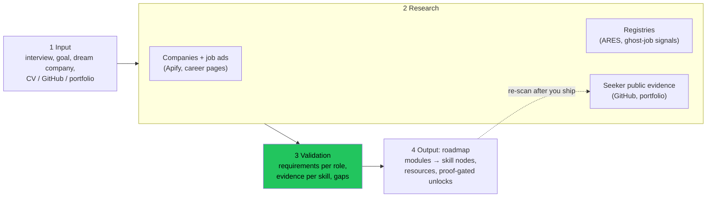

# Implementation plan: proof-gated career roadmap

> An open-source agent that shows a young job seeker what the public web can **prove** about them versus what the employers worth working for actually **require**, with every claim sourced, and turns the gap into a roadmap where you only level up when the internet can prove it.

Demo scope: **Prague, junior backend developer, 10–20 companies.** One city, one role, done deeply.

## 1. Team and roles

| Who | Role | Owns |
|---|---|---|
| **@cufelix** | Builder A: research and engine | API, company and job research, requirement extraction, gap engine, cached demo data |
| **@Dymyt-ry** | Builder B: app and seeker | Web app UI, intake interview, seeker scan (GitHub and portfolio), roadmap map, re-scan and node unlocks |
| **@ZachHtet** | Design and pitch | `MARKET.md`, `BRAND.md`, `DESIGN.md`, roadmap node art, screenshots, README prose, deck, demo video, rehearsal |

Rules from the `hackathon` skill (Team git workflow) apply. **@cufelix merges PRs.** Only **@cufelix** changes `package.json` and the lockfile; ask in the PR or issue if you need a dependency.

Claude sessions on @cufelix's machine: the orchestrator splits issues and summarises PRs, `ethera-hack-8a` implements Builder A issues, and `ethera-hack-59` reviews every PR, including the other builders'.

## 2. How parallel work stays unblocked

**Contract first.** In the first 30 minutes, Builder A commits `src/contracts.ts` (types below) and `fixtures/*.json` (realistic fake data matching them). After that:

- Builder B builds the whole UI against `fixtures/` (`DATA_SOURCE=fixtures`).
- Builder A builds the real pipeline so its output matches the same contracts.
- They switch to live data in two steps: companies and job posts at sync S2, gaps and roadmap at S2b. Nothing in the UI changes.

**Every path has exactly one owner.** Anyone else proposes a change in the issue or PR, and the owner applies it.

| Path | Owner |
|---|---|
| `src/contracts.ts`, `fixtures/` | A |
| `src/research/`, `src/engine/`, `app/api/` (except `app/api/seeker/`), `data/` | A |
| `package.json`, lockfile, `HACKATHON.md`, `MVP.md` | A (@cufelix) |
| `app/(ui)/`, `app/layout.tsx`, `app/globals.css`, Tailwind config, `src/components/` | B |
| `src/seeker/`, `app/api/seeker/` (GitHub scan and re-scan, server side for the token and rate limits) | B |
| `src/styles/tokens.css` (colours, fonts, spacing from `DESIGN.md`; B imports it) | Design and pitch |
| `public/art/`, `public/brand/` (logo SVG), `docs/` (screenshots) | Design and pitch |
| `README.md`, `MARKET.md`, `BRAND.md`, `DESIGN.md`, `PITCH.md` | Design and pitch. Builders post their quickstart and architecture text in issue D5. |

## 3. Architecture (from the whiteboard)



**Proposed stack:** one Next.js (TypeScript) repo, `apify-client`, the Claude API (`claude-sonnet-5-5` for extraction, `claude-haiku-5-5` for bulk classification), and JSON files as storage (no database for a hackathon demo).

## 4. Data contracts (`src/contracts.ts`)

```ts
type Source = { url: string; title: string; fetchedAt: string; quote?: string };

type Claim = {
  id: string;
  subject: { kind: "company" | "seeker"; id: string };
  statement: string;                 // "Requires Docker", "Has public Docker work"
  kind: "fact" | "inference";        // inference must say what it is inferred from
  status: "proven" | "unproven" | "contradicted";
  sources: Source[];                 // empty sources = cannot be "proven"
};

type JobPost = {
  url: string; companyId: string; title: string; role: string;
  skills: string[]; postedAt?: string; firstSeenAt?: string; repostCount?: number;
};

type Company = {
  id: string; name: string; ico?: string; city: string;
  claims: Claim[];                   // registry facts, stated values, headcount
  jobPosts: JobPost[];
  ghostSignals: Claim[];             // e.g. "Open > 90 days", "Reposted 4× in 60 days"
};

type SkillDemand = {
  role: string; skill: string;
  companiesRequiring: number; companiesTotal: number;  // "7 of 10"
  sources: Source[];
};

type SeekerEvidence = { skill: string; claims: Claim[] }; // seeker's own public proof

type Gap = { role: string; skill: string; demand: SkillDemand; evidence: SeekerEvidence };

type RoadmapNode = {
  id: string; module: string; skill: string;
  status: "locked" | "unproven" | "proven";  // proven needs at least one Source
  evidence: Claim[]; resources: Source[];
  kind: "skill" | "mystery";         // mystery = bonus insight (e.g. ghost-job reveal)
};

type Roadmap = { role: string; goal: "learn-fast" | "stability" | "mission"; modules: { name: string; nodes: RoadmapNode[] }[] };
```

**Guardrail baked into the contracts:** there is no number that summarises a person. That means:
- No match percentage.
- No coverage fraction ("6 of 9 skills").
- No XP total and no player level.

The UI shows only **per-skill facts with sources**, for example "Docker: required by 7 of 10 target companies [links]; your public evidence: none found." Demand counts describe companies, not the seeker.

"Levelling up" means one node flips from unproven to proven, with its new evidence linked. The flip and the module unlock are the reward.

Company ethics appear only as sourced claims, never as an opinion score. Companies are never ranked by how well the seeker fits them.

## 5. Work breakdown (issues, about 2 h each or less)

### Together, before splitting (phases 0–3 of the `hackathon` skill)
- **T0** Kickoff: event length, judging criteria, deliverables, confirm roles → `HACKATHON.md`.
- **T1** Market check → `MARKET.md` (led by Design and pitch, all three agree on the verdict).
- **T2** MVP scope → `MVP.md`: the one critical flow below.

**Critical demo flow:** intake (role and goal) → connect GitHub username → "Researching 15 Prague companies…" → gap view with sources → roadmap map → open one node → ship something → re-scan → that node flips to proven with its new evidence linked, and the next node unlocks.

### Builder A (@cufelix): research and engine
| # | Issue | Done when |
|---|---|---|
| A1 | Repo skeleton, `contracts.ts`, `fixtures/` (15 companies, 1 seeker) | B can render from fixtures |
| A2 | Job ads: Apify actor for LinkedIn / jobs.cz → `JobPost[]` for Prague junior backend | 15+ real posts cached in `data/` |
| A3 | Requirement extraction: Claude turns job text into `skills[]` with quote spans as sources | every skill links to its job ad |
| A4 | Company facts: ARES lookup by IČO → registry `Claim`s | each company has at least one registry fact with a link |
| A5 | Ghost-job signals from post age and reposts → `ghostSignals` | shown with source, labelled inference |
| A6 | Aggregation → `SkillDemand[]` ("7 of 10") and `Gap[]` | gap list matches fixtures shape |
| A7 | Goal switch: re-rank companies and gaps by goal | three goals give three different orderings |
| A8 | API routes plus cached replay mode for the live demo | demo runs offline from `data/` |

### Builder B (@Dymyt-ry): app and seeker
| # | Issue | Done when |
|---|---|---|
| B1 | Intake interview UI: role, goal, dream company, GitHub, portfolio URL, consent | writes the intake object |
| B2 | Seeker scan: GitHub public API (repos, languages, topics, READMEs) → `SeekerEvidence[]` | own profile gives sourced evidence |
| B3 | Gap view: per skill, demand "7 of 10" plus links, your evidence or "none found" | every number is clickable to its sources |
| B4 | Roadmap map: modules and isometric nodes (see the reference images), locked / unproven / proven states | renders from fixtures |
| B5 | Node drawer: why it matters (demand and sources), resources, "how to prove it" | opens from the map |
| B6 | Re-scan: re-run B2, flip nodes whose evidence appeared, flip and unlock animation (no totals) | demo flip works on stage |
| B7 | Company card: claims, ghost signals, fact vs inference badges | all from contracts |
| B8 | Switch from fixtures to the live API: companies and job posts at S2, gaps and roadmap at S2b | full flow on real data |

### Design and pitch (@ZachHtet)
| # | Issue | Done when |
|---|---|---|
| D1 | `MARKET.md`: ICP, competitors (Jobscan, LinkedIn skill match, roadmap.sh, ghost-job extensions, Atmoskop, Glassdoor), market size, verdict | team says go |
| D2 | Business model (pricing, lean canvas, scalability) appended to `MARKET.md` | in the file |
| D3 | `BRAND.md`: name, positioning, tagline, voice; logo SVG | B uses it in the UI copy |
| D4 | `DESIGN.md`: colours, fonts, tokens; roadmap node art (isometric tiles, mystery chest) in `public/art/` | **by sync S1**, so B can build the map |
| D5 | README prose, screenshots in `docs/` | after the freeze |
| D6 | Pitch (`PITCH.md`), deck, demo video from the `demo-final` tag | rehearsed three times |

## 6. Timeline and sync points

Times are relative to the start; the 8 h profile from the `hackathon` skill. Adjust once T0 fixes the real length.

| Time | Builder A | Builder B | Design and pitch |
|---|---|---|---|
| 0:00–1:10 | T0–T2 together; A1 contracts and fixtures | T0–T2 together | T0–T2 together; D1 |
| **S1 1:10** | Everyone agrees on `MVP.md`, the contracts, the critical flow | | |
| 1:10–3:30 | A2, A3, A4 | B1, B2, B3 | D2, D3, D4 |
| **S2 3:30** | Partial switch: B8 step 1 shows live companies and job posts (A2–A4). Gaps and roadmap stay on fixtures. | | |
| 3:30–5:00 | A6, A8 | B4, B5 | D5 drafts |
| **S2b 5:00** | Full switch: B8 step 2 runs live gaps and roadmap (A6 + A8). Does the happy path run end to end? | | |
| 5:00–6:00 | A5, A7 | B6, B7 | D6 story and deck |
| **S3 6:00** | Feature freeze: tag `demo-final`. Only fixes after this | | screenshots and video from the tag |
| 6:00–7:15 | Bug fixes, cached demo run | Polish, bug fixes | D5, D6 |
| **S4 7:15** | Rehearsal, the whole team, with a timer | | |

## 7. Git workflow (short form of the skill's rules)

- Branch per issue: `<github-user>/<issue>-<slug>` off the latest `main`. Never commit to `main`.
- PR body: `Closes #<issue>` plus what you ran to check it. Small PRs, merged within about an hour.
- `ethera-hack-59` reviews, and @cufelix merges. After every merge everyone pulls, and the merger runs the demo flow.
- `main` broken: revert the merge through a PR, never fix forward and never force-push.
- Tag each known-good `main` as `demo-ok-<HHMM>`.

## 8. Open decisions (answer at T0)

1. ~~Who is Builder B and who is Design and pitch?~~ Decided: @Dymyt-ry is Builder B, @ZachHtet is Design and pitch.
2. **Top 3 career paths** (backend, DevOps, frontend on the whiteboard) versus "one role" in the guardrails. Proposal: backend fully live; DevOps and frontend as a comparison on cached data only.
3. **"User match %" and "chance to get each position"** on the whiteboard conflict with the brief's ban on scoring a person. Proposal: drop both. Show per-skill facts only (demand across companies, plus the seeker's sourced evidence or "none found"), with no totals, fractions, percentages or fit-based ranking (see section 4).
4. **Namesake check** touches other people's data. Proposal: only report "the top N results for your name are not you", and store nothing about them.
5. **LinkedIn data for the seeker:** only what the seeker pastes or exports (consent), no scraping their profile.
6. **Event length and deadline** set the real timeline in section 6.
