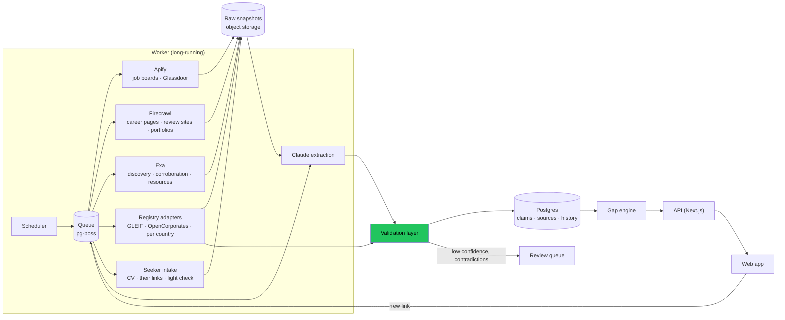

# Implementation plan: proof-gated career roadmap

> An open-source agent that shows a young job seeker what the public web can **prove** about them versus what the employers worth working for actually **require**, with every claim sourced, and turns the gap into a roadmap where you only level up when the internet can prove it.

**Built for production, not as a demo.** Real scrapers on a schedule, real history in a database, a validation layer that decides what we are allowed to claim, and real users with accounts. Fixtures exist only as test data.

**Scope: worldwide, every profession.** Nurses, accountants, designers, electricians, marketers and developers alike, in any country. Nothing in the code may assume a country, a language or a tech job:
- Occupations and skills use the ESCO taxonomy (multilingual, covers all occupations), mapped to O*NET for the US.
- Company registries are per-country adapters behind one interface.
- The heavy research is on employers and the job market. The seeker side works mainly from what the seeker gives us: the intake interview, their CV, and the links they choose to share. On top of that comes a small amount of checking (fetching and reading those links, a quick web search with their consent). We do not go out and research the person.
- Coverage grows country by country as adapters and sources are added. The product never pretends to cover a country it has no sources for.

## 1. Team and roles

| Who | Role | Owns |
|---|---|---|
| **@cufelix** | Builder A: research (employers and job market) | Source research, scrapers, job and company pipeline, registries, extraction, validation layer, gap engine, database schema, workers, cost control, monitoring. Merges PRs. |
| **@Dymyt-ry** | Builder B: user input (for now) | Auth and accounts, intake interview, CV reading, the seeker's links and the light check on them, consent, and privacy (view, export, delete the seeker's data) |
| **@ZachHtet** | Design and pitch | Market and business model, brand, design system and tokens, roadmap art, product copy, landing page, docs, pitch |

**Current split (2026-10-08):** @cufelix does the research, @Dymyt-ry does the user input. The rest of the app UI (gap view, roadmap, company page, review queue) has no owner yet. It's listed under "App UI" in section 8 and gets assigned once the research and the input parts produce real data. Until then @Dymyt-ry owns the UI paths in section 2 so the intake screens have a home.

Claude sessions on @cufelix's machine: the orchestrator turns issues into tasks and summarises PRs, the implementer session builds Builder A issues, and the reviewer session reviews every PR (all three people's).

## 2. Parallel work without collisions

**Contract first.** Builder A's first PR defines `src/contracts.ts` (section 6) and the first database migration. Until A's API is live, Builder B develops against `fixtures/`, which is test data that follows the contracts; the same fixtures back the automated tests. B switches each screen to the real API as soon as the matching endpoint lands, endpoint by endpoint.

**Every path has exactly one owner.** Anyone else proposes a change in the issue or PR, and the owner applies it.

| Path | Owner |
|---|---|
| `src/contracts.ts`, `fixtures/`, `db/migrations/` | A (B requests tables or columns in an issue) |
| `src/sources/`, `src/research/`, `src/validation/`, `src/engine/`, `worker/` | A |
| `app/api/` (except `app/api/seeker/`, `app/api/account/`) | A |
| `package.json`, lockfile, CI config (`.github/workflows/`), `.env.example`, `docs/sources.md` | A |
| `app/(ui)/`, `app/layout.tsx`, `app/globals.css`, Tailwind config, `src/components/` | B |
| `src/auth/`, `src/seeker/`, `app/api/seeker/`, `app/api/account/`, `app/(admin)/` | B |
| `src/styles/tokens.css` (from `DESIGN.md`; B imports it) | Design and pitch |
| `public/art/`, `public/brand/`, `app/(marketing)/` copy, `docs/` (except `docs/sources.md`) | Design and pitch |
| `README.md`, `MARKET.md`, `BRAND.md`, `DESIGN.md`, `PITCH.md` | Design and pitch. Builders post their setup and architecture text in the issue. |

## 3. Sources and tools

We have about **$100 each on Apify, Exa and Firecrawl**. Each tool does what it is best and cheapest at; free official APIs come first wherever one exists.

| Tool | Used for | Why this tool | Price (check before budgeting) |
|---|---|---|---|
| **Apify** | Global job boards (Indeed, Glassdoor, LinkedIn job listings via a multi-board actor) plus national boards per country (for example jobs.cz, StepStone, Seek, Naukri); Glassdoor company reviews, ratings and salaries | Ready-made actors handle pagination, proxies and blocking | Glassdoor actors from about $0.25 to $5 per 1,000 results; national-board actors from a few cents to about $4 per 1,000 |
| **Firecrawl** | Company career pages (`map` → `scrape`), company "about" and values pages, national review sites without an Apify actor (for example Atmoskop, kununu), seekers' portfolio pages | Clean markdown from any site in any language; `map` finds the careers pages | 1 credit per page scrape; LLM JSON extraction adds 4 credits per page, so we extract with Claude instead |
| **Exa** | Discovery and corroboration: finding each company's careers page, engineering blog, news and independent mentions; finding similar companies; curating learning resources for roadmap nodes | Semantic search finds pages that keyword search misses | Search about $7 per 1,000 requests; page contents about $1 per 1,000 |
| **Registries and taxonomies** | Global: GLEIF (legal entity identifiers, free), OpenCorporates (company registers of many countries; check its API terms and price). Per country, as adapters: for example Companies House (UK), SEC EDGAR (US), ARES, ISIR and the VAT register (CZ). Taxonomies: ESCO and O*NET. | Authoritative and the strongest evidence tier | mostly free |
| **Seeker input** | What the seeker gives us: interview answers, CV (PDF or DOCX), and links they choose (portfolio, GitHub, Behance, a certificate or licence page, a LinkedIn export). We fetch and read those links with Firecrawl, and optionally run one Exa search on their name with consent. | The seeker decides what we see; we read it, we don't hunt for more | mostly free |
| **Claude API** | Requirement extraction, skill normalisation, claim drafting | Structured output we version and evaluate ourselves | per token |

**Rough monthly cost per launched market** (one country, roughly 300 companies across all professions). These are estimates to re-check with real runs in R1, and the total grows with each country added:
- Apify: daily job listings plus monthly Glassdoor refresh, about $20–60.
- Firecrawl: weekly career pages, about 5,000–10,000 pages a month.
- Exa: about 2,000–5,000 searches a month, about $15–35.

The **cost ledger** (A13) enforces a hard monthly cap per tool.

**Scraping rules:**
- Only public pages, no logins, no personal profiles of anyone except the consenting seeker.
- Respect `robots.txt`. Per-domain rate limits.
- Retries with backoff. Idempotent jobs. Each source can be switched off on its own.
- Incremental runs: list pages daily, detail pages only for new or changed posts.
- A terms-of-service note for every source in `docs/sources.md`.

## 4. Architecture



**Proposed stack:**
- One TypeScript repo:
  - Next.js for the app and API.
  - A separate long-running worker for scraping, because scrapes outlive serverless timeouts.
- Supabase for Postgres, auth, storage and row-level security, with `pg-boss` on the same Postgres as the queue.
- Clients for `apify-client`, `exa-js` and `@mendable/firecrawl-js`.
- The Claude API: `claude-sonnet-5-5` for extraction, `claude-haiku-5-5` for bulk classification.
- Sentry for errors.
- Hosting: the app on Vercel, the worker on Fly.io or Railway.

This is a proposal. Change it at kickoff, before A1 lands.

## 5. Validation mechanism

The product promise is "every claim sourced", so nothing reaches a user without passing these checks. They run in `src/validation/` and are covered by tests.

1. **Provenance check.**
   - Every claim has at least one `Source` with URL, fetch time, content hash and the raw snapshot in storage.
   - Any quote the LLM gives must appear verbatim in the stored snapshot text. If it doesn't, the claim is rejected. This blocks invented quotes.
2. **Entity resolution.**
   - Companies from different sources are merged only when they share a registry identifier (an LEI, or a national company number from a registry adapter) or a verified web domain.
   - Anything weaker is kept separate and goes to the review queue. A wrong merge would attach one company's reviews to another.
3. **Evidence tiers** on every claim:
   - **verified**: an official registry (a company register, an insolvency register, a professional licence register).
   - **corroborated**: at least two independent sources of different types, for example a job ad and the company's own careers page, or Glassdoor and a national review site. Mirrors and reposts of the same ad don't count as independent.
   - **single-source**: shown with a clear label.
   - **contradicted**: sources disagree. Both sides are shown and the claim goes to the review queue.
4. **Freshness.**
   - Each claim type has a maximum age. Job ads: seen in the last run. Reviews: 90 days. Registry facts: 30 days.
   - Stale claims are re-fetched before they are shown, or labelled with their date.
5. **Extraction quality.**
   - Claude output is schema-validated, and occupations and skills are normalised to ESCO.
   - A labelled set of job ads across at least five languages and five profession groups (for example healthcare, trades, finance, design, software) measures precision and recall in CI, reported per language and per profession. A change that lowers either fails the PR.
   - A sample is extracted twice by different models, and disagreements go to the review queue.
6. **Ghost-job signals come only from our own history.**
   - "Open more than 90 days" or "reposted 4 times in 60 days" is shown only after enough observation time.
   - It is always labelled as an inference, with the post history linked.
7. **Seeker evidence: two levels, never mixed up.**
   - **Stated:** anything only in the CV or interview ("I know Excel"). Shown as stated by the seeker, never as proven.
   - **Proven:** a public link the seeker gave us that we fetched, and that shows the skill. For example a project page, a repo, a certificate page, a published article or a register entry. The link's snapshot is stored like any other source.
   - We only read what the seeker shares. The optional name search only flags "this public result may be you; add it?" and stores nothing unless the seeker confirms.
8. **Scraper health.**
   - Each run records items, nulls per field and errors. A spike in nulls (the site changed its layout), zero items, or two failed runs in a row raises an alert and pauses that source.
   - Canary pages with known content are checked daily.
9. **Review queue.** Contradicted, low-confidence and unresolved items wait for a human. They are not shown until approved.

## 6. Data contracts (`src/contracts.ts`)

```ts
type Source = {
  url: string; title: string; fetchedAt: string;
  tool: "apify" | "firecrawl" | "exa" | "registry" | "seeker-upload" | "seeker-link";
  quote?: string; contentHash: string; snapshotKey: string;
};

type Claim = {
  id: string;
  subject: { kind: "company" | "seeker"; id: string };
  statement: string;                 // "Requires Docker", "Has public Docker work"
  kind: "fact" | "inference";        // inference states what it is inferred from
  tier: "verified" | "corroborated" | "single-source" | "contradicted";
  status: "proven" | "unproven" | "contradicted";
  sources: Source[];                 // empty sources = cannot be shown
  validUntil: string;                // freshness rule
  extractedBy?: { model: string; promptVersion: string };
};

type JobPost = {
  id: string; canonicalUrl: string; companyId: string;
  title: string; language: string;
  occupation: string;                // ESCO occupation id
  country: string; city?: string; remote: boolean;
  skills: string[];                  // ESCO skill ids
  postedAt?: string; firstSeenAt: string; lastSeenAt: string; repostCount: number;
};

type Company = {
  id: string; name: string; domain?: string; country: string;
  registryIds: { scheme: "lei" | string; id: string }[];  // e.g. "lei", "cz-ico", "uk-companies-house"
  claims: Claim[];                   // registry facts, stated values, reviews, headcount
  ghostSignals: Claim[];             // from JobPost history, always kind "inference"
};

type SkillDemand = {
  occupation: string; country: string; city?: string; skill: string;
  companiesRequiring: number; companiesTotal: number;  // "7 of 10" describes companies
  sources: Source[];
};

type SeekerEvidence = {
  skill: string;
  stated: Claim[];                   // from CV or interview only: never counts as proven
  proven: Claim[];                   // from a link the seeker gave us, fetched and snapshotted
};

type Gap = { occupation: string; skill: string; demand: SkillDemand; evidence: SeekerEvidence };

type RoadmapNode = {
  id: string; module: string; skill: string;
  status: "locked" | "unproven" | "proven";  // proven needs a verified or corroborated claim
  evidence: Claim[]; resources: Source[];
  kind: "skill" | "mystery";                 // mystery = bonus insight, e.g. a ghost-job reveal
};

type Roadmap = { seekerId: string; occupation: string; goal: "learn-fast" | "stability" | "mission"; modules: { name: string; nodes: RoadmapNode[] }[] };
```

**Guardrail baked into the contracts:** there is no number that summarises a person. That means:
- No match percentage.
- No coverage fraction ("6 of 9 skills").
- No XP total and no player level.

The UI shows only **per-skill facts with sources**, for example "Docker: required by 7 of 10 target companies [links]; your evidence: stated in your CV, no public proof yet." Demand counts describe companies, not the seeker.

"Levelling up" means one node flips from unproven to proven, with its new evidence linked. The flip and the module unlock are the reward.

Company ethics appear only as sourced claims, never as an opinion score. Companies are never ranked by how well the seeker fits them.

## 7. Privacy and security (GDPR applies: real people, EU)

- We use only what the seeker gives us (interview answers, CV, links, uploads), with explicit consent for each kind.
  - The optional name search runs only after a separate opt-in.
  - Portfolio URL they enter.
  - LinkedIn data only from an export they upload. We never scrape anyone's LinkedIn profile.
- Reviews are stored as company claims. Reviewer names and handles are dropped at ingestion.
- Account page: see everything stored about you, export it, delete it (hard delete, including snapshots).
- Namesake check stores nothing about other people: it only reports "the top results for your name are not you".
- Row-level security on every seeker table. API rate limits.
- API keys for Apify, Exa, Firecrawl and Anthropic only in environment variables or the host's secret store, never in the repo. `.env*` is gitignored.

## 8. Work breakdown (issues)

Each issue is about half a day or less, with tests. "Done" means merged to `main` with CI green.

### Kickoff (everyone)
- **K1** Agree on the stack, the contracts and this plan. Write `MVP.md`: the first release's scope, one city and role pair live.
- **K2** Market check and business model in `MARKET.md` (led by @ZachHtet; all three agree on the verdict).

### Builder A (@cufelix): research (employers and job market)
| # | Issue | Done when |
|---|---|---|
| R1 | **Source research.** Pick 3 pilot countries on different continents and 5 profession groups. For each, test the global actors (Indeed, Glassdoor, the multi-board actor), the best national board, Firecrawl on 20 career pages and the national review site, Exa discovery for 20 companies, and the registry options (GLEIF, OpenCorporates, national register). Measure coverage, field completeness, cost per 1,000 and failure rate. Check terms of service. | `docs/sources.md` picks one tool per source with numbers |
| A1 | Repo skeleton, CI (lint, typecheck, tests), `contracts.ts`, `fixtures/`, Supabase project, first migration | B can build against fixtures; CI blocks a red PR |
| A2 | Worker, `pg-boss` queue, scheduler, scrape-run table, raw snapshot storage | a no-op job runs on a schedule and logs a run |
| A3 | Job boards via Apify (R1's picks) → `JobPost`, incremental runs, dedup by canonical URL and hash | a daily run stores real posts for the pilot countries and professions without duplicates |
| A4 | Career pages via Firecrawl (`map` → `scrape`), discovered with Exa | at least two independent sources feed the same tables |
| A5 | Company reviews: Glassdoor via Apify and national review sites via Firecrawl → review claims without reviewer identities | reviews stored as company claims with sources |
| A6 | Extraction: Claude structured output → ESCO skills with quotes; labelled eval set (100+ ads) in CI | precision and recall reported in CI |
| A7 | Entity resolution: registry adapter interface; name and domain → LEI (GLEIF) or national company number; merge rules | no merge without a registry identifier or a verified domain |
| A8 | Registry adapters for the pilot countries (company status, insolvency where public) | each claim tier "verified" with its register link; adding a country means adding one adapter |
| A9 | Validation layer: provenance and verbatim-quote check, evidence tiers, freshness, double extraction on a sample | invalid claims never reach the API (tests) |
| A10 | Ghost-job signals from post history | shown only after the minimum observation window |
| A11 | Gap engine: `SkillDemand` per city and role, `Gap` per seeker, goal-based ordering (never by fit) | API returns gaps for a real seeker |
| A12 | API endpoints for companies, demand, gaps, roadmap, review queue; rate limiting | the app's screens run on the real API |
| A13 | Cost ledger: every Apify, Firecrawl, Exa and Claude call recorded, with a hard monthly cap per tool | a run stops at the cap and alerts |
| A14 | Monitoring: Sentry, scraper health (null-rate drift, zero items, canaries), alerts | an induced failure alerts and pauses the source |

### Builder B (@Dymyt-ry): user input
| # | Issue | Done when |
|---|---|---|
| B1 | Auth (Supabase), account model, app shell, layout with tokens | sign-up and login work |
| B2 | Intake: occupation, country or remote, goal, dream companies, consent screen | stored per user with consent timestamp |
| B3 | Intake interview plus CV upload: Claude reads the CV and answers into *stated* skills (ESCO) | a real CV gives a list of stated skills with the CV as source |
| B4 | Link check: fetch each link the seeker gave (A's Firecrawl client), read it, turn what it shows into *proven* claims; optional opt-in name search with Exa | a shared project link proves its skill with a stored snapshot |
| B5 | Account privacy: view, export, delete everything | delete removes all seeker rows and snapshots |

### App UI (owner to be decided)
| # | Issue | Done when |
|---|---|---|
| U1 | Gap view: per skill, demand "7 of 10" with links, your evidence or "none found", evidence-tier badges | every number links to its sources |
| U2 | Roadmap map: modules and isometric nodes (reference images), locked / unproven / proven; resources from Exa | renders a real user's roadmap |
| U3 | Node detail: why it matters, resources, how to prove it | opens from the map |
| U4 | Prove a node: the seeker adds a new link (or asks to re-check their links); if it proves the skill, the node flips; unlock animation, no totals | adding a link to a finished project flips the matching node |
| U5 | Company page: claims by tier, reviews, ghost signals, fact vs inference badges, sources | everything from the API |
| U6 | Review-queue admin UI: approve, reject or correct contradicted and low-confidence claims | queue items can be resolved |
| U7 | End-to-end tests (Playwright): sign-up → interview and CV → links → roadmap → prove a node | runs in CI |

### Design and pitch (@ZachHtet)
| # | Issue | Done when |
|---|---|---|
| D1 | `MARKET.md`: ICP, competitors (Jobscan, LinkedIn skill match, roadmap.sh, ghost-job extensions, Atmoskop, Glassdoor), market size with sources | team agrees on the verdict |
| D2 | Business model: pricing, lean canvas, scalability, appended to `MARKET.md` | in the file |
| D3 | `BRAND.md`: name, positioning, tagline, voice; logo SVG in `public/brand/` | B uses it in UI copy |
| D4 | `DESIGN.md` and `src/styles/tokens.css`; roadmap node art (isometric tiles, mystery chest); evidence-tier badge design | before U1 and U2 start |
| D5 | All product copy: empty states, errors, consent text, privacy page, how evidence tiers are explained | reviewed with B |
| D6 | Landing page content and `README.md` (what it is, setup, architecture, privacy) | live with the first release |
| D7 | Pitch: `PITCH.md`, deck, video recorded from the production app | rehearsed |

## 9. Milestones and sync points

There's no clock yet. Set dates at kickoff.

| Milestone | Builder A (research) | Builder B (user input) | App UI (owner to be decided) | Design and pitch | Exit check |
|---|---|---|---|---|---|
| **M0 Foundations** | R1, A1, A2 | B1, B2 | | D1, D3 | CI green, contracts agreed, sources chosen with numbers |
| **M1 First real slice** | A3, A6, A9, A11 (one source, one country and occupation) | B3, B4 | U1 | D2, D4 | a real user's CV and links meet real, validated employer requirements |
| **M2 Full pipeline** | A4, A5, A7, A8, A12, A13 | | U2, U3, U4, U5, U6 | D5 | roadmap and proving a node work on live data; costs under cap |
| **M3 Hardening** | A10, A14 | B5 | U7 | D6 | privacy features, monitoring and end-to-end tests in CI |
| **M4 Release** | production deploy of worker and app | production deploy checks | | D7 | first external users |

Two items sit early or late on purpose:
- A3 must run daily from M1 on, because ghost-job signals (A10) need history to build up.
- R1 comes before any scraper code, so we don't build on an actor that turns out to be broken or too expensive.

## 10. Git workflow

- Branch per issue: `<github-user>/<issue>-<slug>` off the latest `main`. Never commit to `main`.
- PR body: `Closes #<issue>`, plus what you ran to check it. Small PRs.
- CI must be green. The reviewer session reviews, and @cufelix merges.
- Branch protection on `main`: PR required, CI required, no force-push.
- `main` broken: revert the merge through a PR, then fix on the branch.

## 11. Open decisions (answer at kickoff)

1. **LinkedIn job listings.** LinkedIn's terms forbid scraping. Use the multi-board actor's LinkedIn job listings (job ads only, never profiles), or leave LinkedIn out entirely? R1 records the risk either way.
2. **Pilot countries and profession groups** for R1 and the first release. The architecture is worldwide; data coverage grows country by country. Which three countries and five profession groups go first?
3. **Review sources per country.** Glassdoor coverage differs a lot between countries; R1 decides per pilot country whether Glassdoor or a national site is the main review source.
4. **"User match %" and "chance to get each position"** on the whiteboard conflict with the brief's ban on scoring a person. Proposal: drop both and show per-skill facts only (section 6).
5. **Budget after the free credits.** The $100 per tool covers R1 and the first months. Who pays after that, and what's the monthly cap per tool?
6. **Licence.** The one-liner says open source; pick one (MIT or AGPL-3.0) before outside contributors arrive.
7. **Release date.** Sets the milestone dates in section 9.
