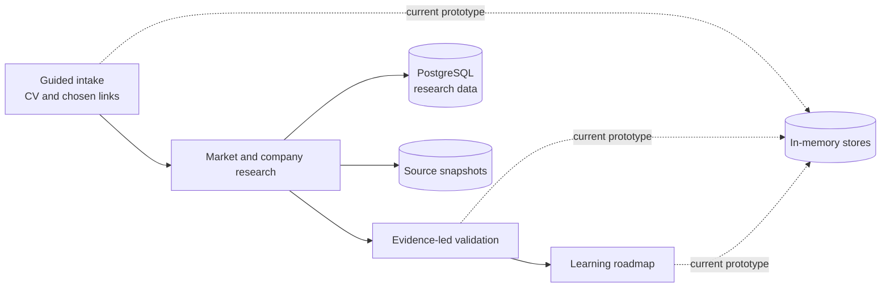

# Waymark

> Evidence-backed career direction, from “I’m not sure” to a practical learning plan.

[](https://nodejs.org/)
[](https://www.typescriptlang.org/)
[](https://www.postgresql.org/)
[](https://pnpm.io/)
[](https://github.com/cufelix/Waymark/actions/workflows/ci.yml)
[](LICENSE)

Waymark turns a person’s own preferences, experience and chosen links into a sourced view of the job market and a roadmap they can act on. It does not reduce a person to a score or claim to predict whether they will be hired.

> [!IMPORTANT]
> Waymark is a hackathon prototype, not a production service. The checked-in intake deck is fake test data, Parts 1, 3 and 4 currently use in-memory stores, and API-key access is not user authentication. See [Production readiness](#production-readiness) before using real personal data.

## What Waymark does

- **Guided intake** — warm-up questions, real-work task cards, practical constraints and an optional final chat.
- **Evidence-led research** — vacancies, companies, career paths, market facts and salary ranges retain their sources.
- **Honest validation** — employer demand sits next to evidence the seeker stated or chose to prove; no fit score or hiring probability.
- **Practical roadmap** — prerequisite-ordered chapters, demand context and source-checked learning resources shaped by time, budget and education.
- **User data controls** — consent, export and cascade deletion endpoints are part of the API contract.

## How it works



Every market fact is expected to keep provenance. Quotes produced from a source must occur verbatim in the fetched content or the claim is rejected. Model-written URLs are not trusted; verified source URLs win.

## Repository map

| Area | Purpose |
|---|---|
| `src/seeker/` | Intake, interview, CV extraction, links, consent, export and delete |
| `src/research/` | Company, vacancy, market and seeker-link research |
| `src/gap/` | Employer demand beside the seeker’s stated/proven evidence |
| `src/roadmap/` | Target role, learning chapters, resources and progress |
| `src/api/` | Hono adapters that mount the four parts behind one API |
| `src/storage/` | Content-addressed source snapshots |
| `prototype/` | Browser prototype and local API bridge |
| `API.md` | Shared HTTP and data contract |
| `PLAN.md` | Architecture, product rules and delivery plan |

## Run locally

### Requirements

- Node.js 22 or newer
- pnpm
- Docker, or a local PostgreSQL 17 installation

### Setup

```bash
pnpm install --frozen-lockfile
cp .env.example .env
docker compose up -d db
pnpm migrate
pnpm dev
```

The API listens on `http://localhost:8787` by default. All `/v1/*` routes require a bearer key from `API_KEYS`.

The dependency policy may temporarily reject packages published too recently. Do not bypass that safeguard blindly; inspect the affected lockfile entries or wait for the configured release-age window.

## Configuration

Start from `.env.example`. Production deployments need unique, long values for `POSTGRES_PASSWORD`, `API_KEYS` and `PROOF_SECRET`.

External services are optional by feature:

| Variable | Used for |
|---|---|
| `OPENROUTER_API_KEY` | Structured extraction, interview turns and roadmap planning |
| `OPENROUTER_ZDR`, `OPENROUTER_DATA_COLLECTION` | Fail-closed provider privacy routing; defaults to zero retention and denied data collection |
| `EXA_API_KEY` | Discovery, salary sources, task cards and learning resources |
| `FIRECRAWL_API_KEY` | Reading public pages selected by the seeker |
| `APIFY_TOKEN` | Vetted public-data actors |
| `GITHUB_TOKEN` | GitHub API access for seeker-selected repositories |

Paid tools have monthly caps through `CAP_*_USD`. Keep the defaults low until a real workload has been measured.

## Tests

The framework-free seeker, validation and roadmap suite runs directly on Node:

```bash
node --test $(git ls-files 'src/seeker/*.test.ts' 'src/seeker/**/*.test.ts' 'src/gap/*.test.ts' 'src/roadmap/*.test.ts') src/seeker/intake/*.test.ts
```

At the PR #22 merge commit, that command passed 294 tests. After dependencies are installed, run the full verification suite:

```bash
pnpm check
```

The same command runs in CI on every pull request and push to `main`.

## Privacy and security

The codebase is designed around data minimisation and traceable evidence:

- it works primarily from information the seeker submits or explicitly links;
- name search is a separate opt-in and is currently disabled by the missing profile-name field;
- public-page readers do not use logins, cookies, captcha bypasses or paywalled content;
- structured application logs are designed to exclude prompts, CV text and seeker content;
- export and cascade-delete endpoints cover the four product parts;
- unexpected upstream bodies are not returned to clients.

OpenRouter requests default to zero-retention endpoints with provider data collection denied. This routing control reduces provider-side retention; it does not keep data on this server or replace processor agreements and transfer safeguards.

These controls are a foundation, not proof of GDPR compliance. A real deployment still needs persistent user-scoped storage and authentication, a retention schedule, a complete export, processor agreements and transfer safeguards, tested backup deletion, incident procedures and an operator-specific privacy notice. Read [Privacy and data handling](docs/privacy-and-data.md) and the [readiness audit](docs/readiness-audit.md).

Security issues should be reported through the process in [SECURITY.md](SECURITY.md), not a public issue.

## Production readiness

Do not use real seeker data until the P0 items in [docs/readiness-audit.md](docs/readiness-audit.md) are closed. The most important are:

1. replace the fake intake deck and stub occupation identifiers with reviewed, sourced data;
2. replace the in-memory seeker, validation and roadmap stores with persistent user-scoped storage;
3. replace the shared API key with real user authentication and ownership checks;
4. make export include every stored personal-data representation, not only the public result objects;
5. define and enforce retention, processor and zero-retention policies;
6. restore reproducible dependency installation, clear known dependency vulnerabilities and add CI.

## License

Licensed under the [Apache License 2.0](LICENSE).
