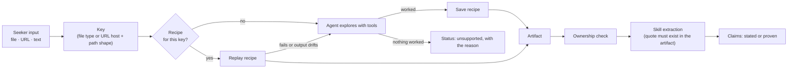

# User research: reading any input a seeker gives us

Part 2, owner @cufelix. This is the research for how the "user research" step works when we don't know in advance what the seeker gives us. It could be a CV, a GitHub link, a SoundCloud profile, a TikTok account, a Behance portfolio, a personal website, or something nobody has thought of yet. The step has to handle every one of them well, and say clearly when it can't.

## The core idea: an agent that adapts, and remembers what worked

We don't write an adapter per platform. For each input, a Claude agent with a fixed set of tools works out how to read it. When it succeeds, it saves the method as a **recipe** for that kind of input. The next input of the same kind replays the recipe directly: cheap, fast and repeatable. The agent only steps in again for something new, or when a recipe stops working.



**The agent's tools** (nothing else, no shell, no logins):

| Tool | What the agent uses it for |
|---|---|
| `fetch_url` | plain HTTP fetch and readable-text extraction (free, try first for simple pages) |
| `firecrawl_scrape` / `firecrawl_map` | JavaScript-heavy sites and multi-page portfolios (refuses social platforms) |
| `apify_store_search` | find actors for a platform (Apify's store search API), sorted by users, rating and recent runs |
| `apify_run_actor` | run a chosen actor with a small item limit |
| `exa_search` / `exa_contents` | read a page another tool couldn't; find a profile's related pages |
| `official_api` | known free APIs (GitHub, YouTube Data API) |
| `parse_file` | PDF, DOCX, images (Claude vision) |

**A recipe** is data, not code: the key, the tool, the actor ID and its input template, the fields to keep, and the expected output shape. Recipes live in Postgres. Any recipe can be reviewed, pinned or disabled by a person.

```ts
type Recipe = {
  key: string;                    // "url:soundcloud.com/{user}", "file:pdf"
  steps: { tool: string; params: Record<string, unknown> }[];   // e.g. apify_run_actor goat255/soundcloud-scraper
  outputMap: Record<string, string>;   // actor fields → Artifact fields
  expectedShape: string[];        // fields that must be present for the run to count as success
  stats: { runs: number; successes: number; lastSuccessAt?: string; usdPerRun: number };
  status: "learned" | "pinned" | "disabled";
};
```

**Guardrails, because an agent spends money and touches the web:**
- **Budget per input:** at most 8 tool calls and about $0.05 in tool costs to explore. Past that, the input is marked `unsupported` with what was tried.
- **Actor allowlist rules:** only actors with at least a minimum number of users and a successful run in the last 30 days. Never actors that need a login or cookies.
- **Item limits** on every Apify run, so exploring never pulls thousands of results.
- **Public pages only:** no login, no captcha solving, nothing behind a paywall.
- **The checks after extraction stay deterministic code, not the agent:** ownership (section 4), the verbatim-quote check, and stated vs proven. The agent decides how to read an input. It never decides what counts as proof.
- **Recipe health:** if a recipe's success rate falls, or its output no longer has the expected fields, it's demoted and the agent explores again. Repeated failures alert a person.

**Why this beats hand-written adapters:** a new platform, such as a seeker pasting a Bandcamp or a Kaggle profile, works on day one without a code change. The first seeker with that platform pays the exploration cost, and everyone after gets the recipe.

The table below is the **seed**. It lists the recipes we pin at launch for common inputs, so the agent rarely has to explore for them.

## 1. Seed recipes: which tool reads what

Prices are per 1,000 results from the Apify Store and vendor pages. Each actor is community-maintained, so check it before relying on it.

| Input | 1st choice | Fallback | What it proves |
|---|---|---|---|
| CV (PDF, DOCX) | local parsing (`pdf-parse`, `mammoth`); Claude vision for scanned PDFs | | **stated** skills, experience, education |
| Image (certificate, design work) | Claude vision | | stated, or proven if it links to a verifiable issuer page |
| GitHub, GitLab | official REST API (free; 5,000 requests an hour with a token) | Firecrawl | authored repos (no forks), languages, commits, READMEs, CI and test files |
| LinkedIn | the seeker uploads their LinkedIn data export | Exa `people` search (only with name-search consent) | mostly **stated**: it is self-described |
| TikTok | Apify TikTok profile actor (for example `apidojo`, about $0.30 per 1,000 posts) | Exa contents | content made: topics, captions, cadence, reach |
| Instagram | Apify Instagram profile actor (about $0.50–1.50 per 1,000) | | content made: captions, posts, cadence |
| YouTube | YouTube Data API (free quota) plus captions | Apify YouTube actor (about $0.50 per 1,000 videos) | videos made, transcripts, topics |
| SoundCloud | Apify SoundCloud actor (for example `goat255`, about $0.40 per 1,000 tracks) | Exa contents | tracks released, genres, plays, release cadence |
| Behance | Apify Behance actor (about $4–7 per 1,000 projects) | Firecrawl | projects, tools used, creative fields |
| Dribbble | Firecrawl on the profile page | Apify Dribbble actor (profile cards only) | shots, skill tags |
| X (Twitter) | Apify X actor | Firecrawl (+29 credits per page) | writing, topics; low priority |
| Personal site, blog, Medium, Substack, an online PDF, Notion, Linktree | Firecrawl (`scrape`, `map` for multi-page portfolios) | plain fetch, then Exa contents | whatever the page shows |
| Any other URL | Firecrawl | Exa contents | generic page text |
| Interview answers | already text | | **stated** only |

Key facts behind this table:
- **Firecrawl refuses social platforms.** Users report "This website is no longer supported" for Instagram, TikTok and YouTube. So social links go to Apify or official APIs, and Firecrawl handles the open web.
- **Free official APIs come first** (GitHub, YouTube). They are stable, legal and free; Apify is for platforms without a usable API.
- **Exa is the last fallback** for reading a page (`/contents`), and the tool for the opt-in name search (`category: "people"`, an index of about 1 billion public profiles).

## 2. Media: audio and video

For a musician on SoundCloud or a creator on TikTok, the skill is in the media, not in text. Version 1 works from what the platforms already give as text and numbers:
- titles and descriptions
- genres and tags
- captions and transcripts (YouTube captions; TikTok subtitles when the actor returns them)
- cadence (how often they release)
- reach (plays, views, followers)
- collaborations

That proves "releases music regularly in genre X" or "publishes edited short-form video weekly". It doesn't prove "mixes well".

Claude vision reads thumbnails and portfolio images.

*Known limit:* we don't listen to audio or watch video in version 1. Add transcription and audio or video analysis when a profession needs it and the cost per seeker allows it.

## 3. The normalised artifact

```ts
type Artifact = {
  inputId: string;                       // the lnk_ or doc_ id from Part 1
  platform: string;                      // "github", "soundcloud", "tiktok", "web", "cv-pdf"…
  extractor: "official-api" | "apify" | "firecrawl" | "fetch" | "exa" | "local-parse" | "vision";
  status: "extracted" | "partial" | "unsupported" | "failed";
  reason?: string;                       // why partial, unsupported or failed
  owner?: { displayName?: string; handle?: string; links: string[] };   // as the platform shows it
  text: string;                          // normalised readable content
  fields: Record<string, unknown>;       // structured data: repos, tracks, videos, counts…
  items: { title: string; url?: string; date?: string; text?: string; metrics?: Record<string, number> }[];
  source: Source;                        // as in API.md, with snapshot and hash
};
```

## 4. Is it really theirs? (light ownership check)

Anyone can paste someone else's TikTok. Before anything from a link counts as **proven**, we look for at least one ownership signal:
- The name or handle matches across inputs (the CV name against the profile display name, or the same handle on several platforms).
- Cross-links: the profile links back to another input the seeker gave us (bio link, Linktree, website footer).
- The seeker connected the account themselves (GitHub OAuth, later).
- The seeker puts a short code we give them into their bio, if they want the highest level.

No signal: the content still shows up, but its skills stay **stated** ("you say this is yours"), never proven. We never conclude it belongs to someone else, and we store nothing about anyone else.

## 5. The "small research" on top

This is the only research that goes beyond what the seeker gave us:
- **One hop of links the seeker's own profiles point to.** For example, a Linktree links to a SoundCloud: we read that SoundCloud too. We go only one hop, and only from profiles that passed the ownership check.
- **Name search:** only with `consent.nameSearch`. It uses Exa `people` search plus one web search, and returns "this may be you, add it?" candidates. Nothing is stored unless the seeker confirms.

## 6. Making it reliable

We can't promise perfect, but we can make sure nothing breaks quietly:
- **Recipe first, agent second,** retries with backoff, and a time limit per tool call.
- **A status and reason for every input**, so the seeker sees "TikTok: read 48 videos" or "this site blocks readers; upload a PDF instead".
- **Golden test set:** 3–5 real public profiles per platform (team members' own, with consent) with expected skills, run in CI and nightly against the live services. A platform whose output drifts gets flagged.
- **Success rate per extractor** is monitored. When an Apify actor breaks, its recipe is demoted, the agent finds a replacement, and a person is alerted.
- **Cost per seeker** is logged in the cost ledger. A rough target is under $0.10 per seeker for scraping, plus Claude tokens.

## 7. Research tasks before coding (R1 for user research)

| # | Question | How we answer it |
|---|---|---|
| U-R0 | Can the agent find and run the right actor by itself? | Give it 20 unseen platforms (Bandcamp, Kaggle, Etsy, Twitch…) and measure: solved, cost, tool calls |
| U-R1 | Which Apify actor per platform actually works today (for the seed recipes)? | Run 2–3 candidates per platform on the golden profiles; record success, fields, speed and price in `docs/sources.md` |
| U-R2 | What does Firecrawl really refuse? | Try each platform's URLs with our key, record the exact errors |
| U-R3 | How good is Exa `/contents` as a fallback for blocked pages? | The same URLs through Exa, comparing completeness |
| U-R4 | Do TikTok and Instagram actors return captions or transcripts? | Check the actor output on the golden profiles |
| U-R5 | Claude skill extraction quality per platform | 20 artifacts per platform labelled by hand; precision and recall |
| U-R6 | LinkedIn: export upload only, or also Exa `people`? Is a profile actor acceptable? | Terms-of-service review and a team decision |

## 8. Contract changes this needs in `API.md`

- `SeekerLinkInput.kind` should become optional. The seeker (and Part 1) can't always know what a link is; Part 2 detects the platform.
- `SeekerResearch.links[]` needs `platform`, `status` (`extracted` / `partial` / `unsupported` / `failed`), `reason` and `ownership` (`confirmed` / `unconfirmed`), so the UI can explain each input.
- `SeekerDocument.kind` should allow more than `"cv"` (`"certificate"`, `"portfolio"`, `"image"`, `"other"`).

Agree on these with @Dymyt-ry before Part 1 locks its types.

## Sources

- Apify actors:
  - SoundCloud: [goat255](https://apify.com/goat255/soundcloud-scraper), [unfenced-group](https://apify.com/unfenced-group/soundcloud-scraper.md)
  - TikTok: [apidojo](https://apify.com/apidojo/tiktok-profile-scraper?fpr=97nrp4), [spider_studio](https://apify.com/spider_studio/tiktok-profile-scraper)
  - Behance: [scrapesage](https://apify.com/scrapesage/behance-scraper), [scrapers_lat](https://apify.com/scrapers_lat/behance-scraper)
  - Dribbble: [benthepythondev](https://apify.com/benthepythondev/dribbble-designers-scraper)
- Apify social scraper prices: [use-apify.com category guide](https://use-apify.com/blog/apify-social-media-scrapers-categories-2026), [Instagram guide](https://use-apify.com/docs/how-to-use-apify/scrape-instagram)
- Firecrawl and social sites: [ScrapeCreators blog](https://scrapecreators.com/blog/firecrawl-s-social-media-scraping-restrictions-market-gap-or-strategic-decision). This is a competitor's account; confirm it in U-R2.
- Exa people and company search: [the Exa index](https://exa.ai/docs/reference/the-exa-index), [people vertical](https://exa.ai/docs/reference/verticals/people-for-coding-agents.md)
